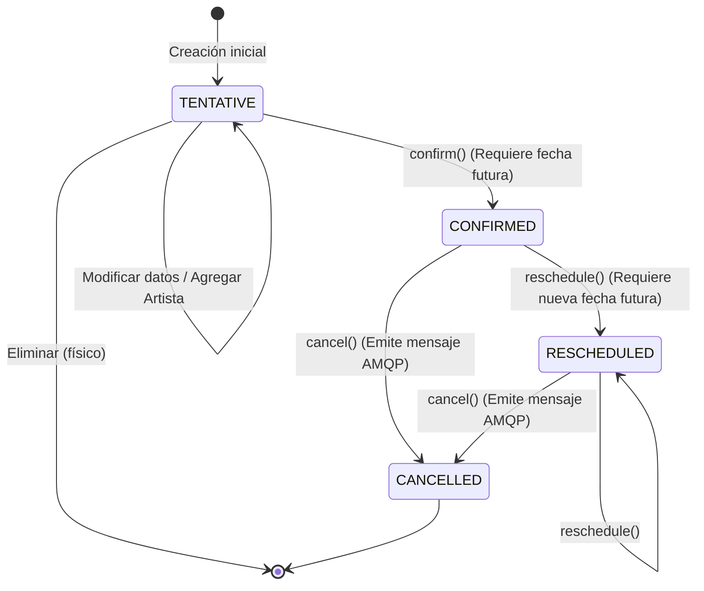

# DOCUMENTO TÉCNICO DE ARQUITECTURA Y DISEÑO
## TRABAJO FINAL - PROGRAMACIÓN DISTRIBUIDA Y CONCURRENTE (PDyC 2026)
### Plataforma Distribuida de Gestión de Eventos y Red Social ("Greater Events Microservices")

---

**Institución:** Universidad Nacional del Noroeste de la Provincia de Buenos Aires (UNNOBA)  
**Unidad Académica:** Escuela de Tecnología  
**Carrera:** Ingeniería en Informática / Licenciatura en Sistemas  
**Asignatura:** Programación Distribuida y Concurrente (PDyC)  
**Ciclo Lectivo:** Cursada 2026  
**Integrantes:** Bruno Bertacchini, Franco Lovizzio (Grupo de 2 integrantes)  
**Mejoras Seleccionadas:**
* **Opción E:** Contenerización Completa y Orquestación (Docker Compose)
* **Opción F:** Calidad y Pruebas Automatizadas (Unitarias y de Integración con Mockito, JUnit 5 y H2)

---

## 1. INTRODUCCIÓN Y ALCANCE DEL SISTEMA

### 1.1 Contexto y Problemática
Los sistemas modernos de venta y catálogo de espectáculos masivos enfrentan desafíos críticos de concurrencia, disponibilidad, escalabilidad y consistencia. En arquitecturas monolíticas tradicionales, los picos de tráfico ante cancelaciones de eventos, reprogramaciones o ventas masivas degradan el rendimiento general del sistema, acoplando dominios disímiles como la gestión administrativa del catálogo, las interacciones sociales de los usuarios y el despacho masivo de notificaciones.

**Greater Events Microservices** es una solución distribuida diseñada para resolver esta problemática, desacoplando los dominios funcionales en servicios autónomos que se comunican mediante protocolos especializados (HTTP REST, mensajería asíncrona AMQP y llamadas remotas binarias gRPC).

### 1.2 Requerimientos del Sistema
#### Funcionales:
1. **Catálogo de Artistas y Eventos:** Alta, modificación, cambio de estados en el ciclo de vida del evento (`TENTATIVE`, `CONFIRMED`, `RESCHEDULED`, `CANCELLED`), asignación y desvinculación de artistas.
2. **Interacción Social:** Capacidad de los usuarios autenticados de seguir/dejar de seguir artistas, marcar eventos como favoritos y consultar la agenda de sus artistas seguidos.
3. **Identidad y Acceso:** Autenticación centralizada con protocolo OpenID Connect / OAuth2 y control de acceso basado en roles (`ROLE_admin` para gestión administrativa).
4. **Notificaciones Automatizadas:** Despacho automático y confiable de notificaciones a los usuarios interesados ante la cancelación de un evento musical.

#### No Funcionales (Atributos de Calidad Distribuida):
1. **Desacoplamiento Temporal:** La cancelación de un evento no debe bloquearse esperando el procesamiento de las notificaciones a miles de usuarios.
2. **Aislamiento de Fallos y Datos (*Database per Service*):** La caída de una base de datos o servicio no debe comprometer la integridad ni la operatividad de los demás componentes.
3. **Baja Latencia Inter-Servicio:** Consultas de alto volumen entre servicios deben resolverse con protocolos binarios de alta eficiencia (gRPC sobre HTTP/2).
4. **Portabilidad y Despliegue:** Toda la solución debe ser reproducible en cualquier entorno mediante contenedores sin dependencias externas preinstaladas.
5. **Verificabilidad:** Cobertura de pruebas automatizadas que garanticen la solidez de las reglas de negocio y los contratos de integración.

---

## 2. ARQUITECTURA GENERAL Y TOPOLOGÍA DEL SISTEMA

El sistema implementa el estilo arquitectónico de **Microservicios** sobre la pila tecnológica **Spring Cloud 2024.0.1** y **Spring Boot 3.4.5**, ejecutado sobre el entorno de ejecución **Java 17**.

### 2.1 Diagrama de Arquitectura Global

```
                                      +-------------------------------+
                                      |         Eureka Server         |
                                      |     (Service Discovery 8761)  |
                                      +---------------+---------------+
                                                      ^
                                                      | Heartbeat & Registro
+--------------------+  JWT Bearer   +----------------+---------------+
| Cliente Web / REST | ------------> |          API Gateway           |
+--------------------+               |   (Spring Cloud Gateway 8080)  |
                                     +----------------+---------------+
                                                      |
                  +-----------------------------------+-----------------------------------+
                  | (HTTP REST + TokenRelay)          | (HTTP REST + TokenRelay)          | (HTTP REST + TokenRelay)
                  v                                   v                                   v
    +---------------------------+       +---------------------------+       +---------------------------+
    |      catalog-service      |       |    user-social-service    |       |   notification-service    |
    |        (Port 8082)        |       |    (8083 REST / 9091 gRPC)|       |        (Port 8085)        |
    +-------------+-------------+       +-------------+-------------+       +-------------+-------------+
                  |                                   ^                                   ^
                  | 1. Publica Evento                 |                                   |
                  |    AMQP                           | 3. Consulta gRPC                  | 2. Consume Evento
                  v                                   |    (Followers / Favoriters)       |    AMQP
         +-----------------+                          +-----------------------------------+
         |    RabbitMQ     | -------------------------------------------------------------+
         | (Topic Exchange)|
         +-----------------+

                  |                                   |                                   |
                  v                                   v                                   v
         +-----------------+                 +-----------------+                 +-----------------+
         | greater_catalog |                 |  greater_users  |                 |  greater_notif  |
         | (PostgreSQL 16) |                 | (PostgreSQL 16) |                 | (PostgreSQL 16) |
         |   (Port 5433)   |                 |   (Port 5434)   |                 |   (Port 5435)   |
         +-----------------+                 +-----------------+                 +-----------------+
```

### 2.2 Inventario de Componentes y Puertos

| Módulo / Contenedor | Puerto Host | Puerto Contenedor | Protocolo | Responsabilidad Técnica |
| :--- | :---: | :---: | :---: | :--- |
| **`api-gateway`** | `8080` | `8080` | HTTP/1.1 (WebFlux) | Puerta de entrada única, enrutamiento dinámico, retransmisión de tokens JWT (`TokenRelay`). |
| **`eureka-server`** | `8761` | `8761` | HTTP/1.1 | Registro y catálogo de instancias de servicio vivas (*Service Discovery*). |
| **`config-server`** | `8888` | `8888` | HTTP/1.1 | Servidor de configuración centralizada en modo nativo (`classpath:/config`). |
| **`catalog-service`** | `8082` | `8082` | HTTP/1.1 (MVC) | Administración del catálogo de artistas y eventos. Publicador de eventos AMQP. |
| **`user-social-service`** | `8083` | `8083` | HTTP/1.1 (MVC) | API REST para seguimiento, favoritos y administración de usuarios Keycloak. |
| **`user-social-service (gRPC)`** | `9091` | `9091` | gRPC sobre HTTP/2 | Servidor RPC binario de alta velocidad para consultas internas de relaciones sociales. |
| **`notification-service`** | `8085` | `8085` | HTTP/1.1 (MVC) | Consumidor AMQP, cliente gRPC y consulta de notificaciones de usuario. |
| **Keycloak IAM** | `8084` | `8080` | HTTP/1.1 | Identity Provider (IdP) OAuth2 / OpenID Connect (Realm `unnoba`). |
| **RabbitMQ Broker** | `5672` | `5672` | AMQP 0-9-1 | Broker de mensajería orientada a eventos para desacoplamiento asíncrono. |
| **RabbitMQ Management** | `15672` | `15672` | HTTP/1.1 | Consola gráfica de monitoreo de colas, exchanges y tasas de consumo. |
| **PostgreSQL Catalog** | `5433` | `5432` | PostgreSQL Wire | Persistencia relacional de catálogo (`greater_catalog`). |
| **PostgreSQL Users** | `5434` | `5432` | PostgreSQL Wire | Persistencia relacional social y referencias de usuarios (`greater_users`). |
| **PostgreSQL Notifications** | `5435` | `5432` | PostgreSQL Wire | Persistencia relacional de notificaciones (`greater_notifications`). |

---

## 3. DECISIONES DE DISEÑO Y PATRONES DISTRIBUIDOS

### 3.1 Patrón *Database per Service*
* **Problema:** En sistemas distribuidos, compartir una base de datos única genera acoplamiento temporal y estructural en los esquemas, introduce cuellos de botella de concurrencia y viola los límites de contexto acotado (*Bounded Context* de DDD).
* **Solución Aplicada:** Cada microservicio (`catalog-service`, `user-social-service`, `notification-service`) es dueño exclusivo de su esquema físico en instancias independientes de PostgreSQL.
* **Manejo de Relaciones Cruzadas:** `user-social-service` no guarda llaves foráneas directas hacia las tablas de catálogo; en su lugar, almacena identificadores numéricos (`Set<Long> followedArtists`, `Set<Long> favoriteEvents`). Cuando el cliente solicita la información enriquecida (nombre del artista, fecha del evento), el servicio utiliza **OpenFeign** para consultar sincrónicamente al `catalog-service` y componer los DTOs en memoria.

### 3.2 Patrón *API Gateway* y Seguridad con *Token Relay*
* **Enrutamiento Centralizado:** Los clientes externos nunca interactúan con los puertos internos de los microservicios (`8082`, `8083`, `8085`). El Gateway (`8080`) utiliza Spring Cloud Gateway reactivo para redirigir tráfico mediante identificadores de servicio descubiertos en Eureka (`lb://catalog-service`, `lb://user-social-service`, `lb://notification-service`).
* **Seguridad OAuth2 / JWT:**
  1. El cliente autentica contra Keycloak (`POST /realms/unnoba/protocol/openid-connect/token`) y obtiene un JWT firmado mediante RSA.
  2. El cliente envía la petición al Gateway con `Authorization: Bearer <JWT>`.
  3. El Gateway aplica el filtro **`TokenRelay`**, transmitiendo el encabezado HTTP sin alteraciones a los microservicios downstream.
  4. Cada microservicio está configurado como un **OAuth2 Resource Server**, validando criptográficamente la firma del token contra las llaves públicas de Keycloak (`jwk-set-uri`).
  5. La clase [`KeycloakJwtGrantedAuthoritiesConverter`](file:///Users/brunobertacchini/IdeaProjects/pdyc2026-junin-bertacchini-lovizzio/greater-events-ms/catalog-service/src/main/java/ar/edu/unnoba/pdyc2026/catalog/security/KeycloakJwtGrantedAuthoritiesConverter.java) parsea la estructura de roles del JWT (`realm_access.roles`) transformándolos en `GrantedAuthority` reconocibles por Spring Security (ej. `ROLE_admin`).

### 3.3 Arquitectura Orientada a Eventos (*Event-Driven*) con RabbitMQ
Para la notificación de eventos cancelados, se descartó el encadenamiento de llamadas REST síncronas debido a los riesgos de bloqueo y fallos en cascada:

```
[ Admin ] ---> PUT /admin/events/{id}/cancel
                  |
                  v
         +-----------------+
         | catalog-service | -> 1. Persiste estado CANCELLED en greater_catalog
         +--------+--------+
                  |
                  | 2. rabbitTemplate.convertAndSend(exchange, routingKey, msg)
                  v
       =======================
       RabbitMQ Topic Exchange: "events.exchange"
       Routing Key: "event.cancelled"
       Queue: "event.cancelled.queue" (Durable)
       =======================
                  |
                  v 3. Consumo asíncrono no bloqueante (@RabbitListener)
     +----------------------+
     | notification-service |
     +----------+-----------+
                |
                v 4. Notificaciones guardadas en greater_notifications
```

* **Garantía de Entrega:** La cola está configurada como durable (`durable = true`). Si el servicio de notificaciones está caído al momento de la cancelación, los mensajes se retienen de forma segura en RabbitMQ y se procesan inmediatamente cuando el servicio se recupera.

### 3.4 RPC Binario de Alto Rendimiento (gRPC sobre HTTP/2)
Una vez que `notification-service` recibe el mensaje de cancelación, debe averiguar a quién notificar. Si utilizara REST para consultar miles de registros, la sobrecarga del formato JSON y el protocolo HTTP/1.1 generaría una penalización inaceptable de ancho de banda y latencia.

* **Implementación:**
  * En el módulo compartido [`grpc-api`](file:///Users/brunobertacchini/IdeaProjects/pdyc2026-junin-bertacchini-lovizzio/greater-events-ms/grpc-api/src/main/proto/user_social.proto), se define el contrato Protobuf:
    ```protobuf
    syntax = "proto3";
    package ar.edu.unnoba.pdyc2026.grpc.usersocial;

    service UserSocialGrpcService {
      rpc GetFollowersByArtistId(ArtistFollowersRequest) returns (UserIdsResponse);
      rpc GetFavoritersByEventId(EventFavoritersRequest) returns (UserIdsResponse);
    }
    ```
  * `user-social-service` implementa el servidor en el puerto `9091` mediante `@GrpcService`.
  * `notification-service` consume este servicio mediante `@GrpcClient("user-social-service")` utilizando resolución de nombres integrada con Eureka (`discovery:///user-social-service`).

---

## 4. MODELO DE DATOS Y DOMINIO DE NEGOCIO

### 4.1 Diagrama Entidad-Relación Lógico (Por Microservicio)

#### Catálogo (`catalog-service`):
* **`artists`:** `id` (PK, BigInt), `name` (VarChar, NOT NULL), `genre` (Enum: `ROCK`, `TECHNO`, `POP`, `JAZZ`, `FOLK`), `active` (Boolean, default `true`).
* **`events`:** `id` (PK, BigInt), `name` (VarChar, NOT NULL), `description` (VarChar 1000), `start_date` (Date, NOT NULL), `state` (Enum: `TENTATIVE`, `CONFIRMED`, `RESCHEDULED`, `CANCELLED`).
* **`event_artists`:** `event_id` (FK), `artist_id` (FK). Tabla de unión Many-to-Many.

#### Social (`user-social-service`):
* **`users`:** `id` (PK, BigInt), `username` (VarChar, UNIQUE), `email` (VarChar, UNIQUE).
* **`user_followed_artists`:** `user_id` (FK), `artist_id` (BigInt). Colección de IDs seguidos.
* **`user_favorite_events`:** `user_id` (FK), `event_id` (BigInt). Colección de IDs favoritos.

#### Notificaciones (`notification-service`):
* **`notifications`:** `id` (PK, BigInt), `username` (VarChar, NOT NULL), `event_id` (BigInt), `message` (VarChar 1000), `read` (Boolean, default `false`), `created_at` (Timestamp).

### 4.2 Máquina de Estados del Evento y Reglas de Dominio



* **Regla de Integridad de Artistas:** Un artista que posee eventos asignados no puede ser editado ni eliminado físicamente de la base de datos para no corromper históricos; en su lugar, se ejecuta un borrado lógico (`active = false`).
* **Regla de Favoritos:** Un usuario solo puede marcar como favorito un evento si su estado es `CONFIRMED` o `RESCHEDULED` y su fecha de inicio es estrictamente futura.

---

## 5. EVOLUCIÓN DEL SISTEMA – MEJORAS INCORPORADAS

### 5.1 Opción E – Contenerización y Orquestación Completa (Docker Compose)

#### Diseño de los Dockerfiles
Para cada uno de los 6 microservicios Spring Boot se diseñaron `Dockerfile` optimizados empleando la imagen base oficial `eclipse-temurin:17-jre`. El uso de Alpine Linux reduce el tamaño final de cada contenedor a menos de 200 MB, minimiza la superficie de vulnerabilidades de seguridad y optimiza los tiempos de arranque:

```dockerfile
FROM eclipse-temurin:17-jre
WORKDIR /app
COPY target/*.jar app.jar
EXPOSE <PORT>
ENTRYPOINT ["java", "-jar", "app.jar"]
```

#### Orquestación en `docker-compose.yml`
El archivo de composición orquesta **11 contenedores interconectados** garantizando:
1. **Red Aislada:** Todos los servicios operan dentro de la red tipo puente (`bridge`) `greater-events-net`.
2. **Sincronización mediante Healthchecks:** Los microservicios Java no intentan conectarse a bases de datos o brokers que aún están inicializándose. Se configuraron healthchecks activos:
   * PostgreSQL: `pg_isready -U postgres -d <dbname>`
   * RabbitMQ: `rabbitmq-diagnostics -q ping`
3. **Orden de Arranque Estricto (`depends_on` con condiciones):**
   * `config-server` se inicia primero.
   * `eureka-server` espera a `config-server`.
   * Los servicios de negocio esperan que sus bases de datos específicas reporten estado `healthy`, que RabbitMQ esté `healthy` y que Eureka esté listo.

---

### 5.2 Opción F – Calidad y Pruebas Automatizadas

Se implementó una estrategia de verificación en dos capas complementarias: **Pruebas Unitarias Aisladas (Mockito puro)** y **Pruebas de Integración (@SpringBootTest + H2)**, alcanzando un total de **42 pruebas automatizadas**:

```
                         /\
                        /  \
                       /    \
                      / INT. \   --> 8 Tests de Integración (@SpringBootTest + H2)
                     / TESTS  \      Validación de contexto, JPA y transacciones
                    /----------\
                   /            \
                  /  UNIT TESTS  \  --> 34 Tests Unitarios Puros (JUnit 5 + Mockito)
                 /  (Lógica Pura) \     Validación exhaustiva de ramas y excepciones
                /------------------\
```

#### 1. Pruebas Unitarias Puras (34 tests):
* **`ArtistServiceTest` (9 tests):** Valida creación válida, rechazo de nombres nulos/vacíos, rechazo de géneros nulos, búsqueda con `ResourceNotFoundException`, filtrado por género, bloqueo de edición cuando hay eventos vinculados, borrado físico vs. borrado lógico (`active = false`).
* **`EventServiceTest` (11 tests):** Valida creación en estado `TENTATIVE`, validación de nombre y fechas, bloqueo de modificaciones en estados no tentativos, rechazo de agregado de artistas desactivados, rechazo de remoción de artistas no pertenecientes, confirmación con fecha futura vs. pasada, reprogramación con validación de fechas, y cancelación con verificación de despacho a RabbitMQ.
* **`UserServiceTest` (8 tests):** Valida seguimiento de artista activo, captura de error si Feign falla o el artista no existe, bloqueo de seguimiento a artista desactivado, validación al dejar de seguir, guardado de eventos favoritos en estados permitidos, y rechazo al intentar marcar favoritos tentativos o pasados.
* **`NotificationServiceTest` (4 tests):** Valida listados de notificaciones, marcado como leído y control de seguridad lanzando `AccessDeniedException` si un usuario intenta alterar notificaciones ajenas.
* **`EventCancelledListenerTest` (2 tests):** Valida el algoritmo de desduplicación de destinatarios entre múltiples artistas y usuarios con el evento en favoritos, así como la resiliencia ante listas nulas de artistas.

#### 2. Pruebas de Integración en Memoria (8 tests):
* **`CatalogServiceIntegrationTest` (5 tests):** Ejecuta transacciones reales contra la base H2 en memoria para validar la persistencia JPA de artistas y eventos.
* **`UserSocialServiceIntegrationTest` (2 tests):** Valida el mapeo y persistencia de las colecciones `@ElementCollection` (`user_followed_artists` y `user_favorite_events`).
* **`NotificationServiceIntegrationTest` (1 test):** Prueba el ciclo completo de procesamiento del listener de mensajería, mock de gRPC y almacenamiento en base de datos.

#### Resolución de Compatibilidad con Java Moderno:
Dado que el entorno de ejecución utiliza versiones recientes de la máquina virtual Java, se configuró el pase del flag `-Dnet.bytebuddy.experimental=true` para garantizar la instrumentación dinámica de ByteBuddy dentro de Mockito sin advertencias ni bloqueos.

---

## 6. GUÍA DE COMPILACIÓN, DESPLIEGUE Y OPERACIÓN

### 6.1 Prerrequisitos del Entorno
* JDK 17 o superior instalado.
* Apache Maven 3.8+ configurado.
* Docker Desktop 4.+ con Docker Compose v2.

### 6.2 Pasos de Ejecución

#### Paso 1: Ejecutar la Suite de Pruebas Automatizadas
Desde la raíz del repositorio (`greater-events-ms`):
```bash
mvn clean test -DargLine="-Dnet.bytebuddy.experimental=true"
```
*Salida esperada:* `BUILD SUCCESS`, 42 pruebas ejecutadas, 0 fallos, 0 errores.

#### Paso 2: Compilar y Empaquetar los Archivos JAR
```bash
mvn clean package -DskipTests
```

#### Paso 3: Desplegar el Ecosistema Completo con Docker Compose
```bash
docker compose up --build -d
```

#### Paso 4: Monitorear el Estado de los Contenedores
```bash
docker compose ps
```
Todos los contenedores deben figurar en estado `running` o `healthy`.

### 6.3 Catálogo de Endpoints Clave para Demostración

| Servicio | Método | Endpoint | Descripción | Autenticación |
| :--- | :---: | :--- | :--- | :---: |
| **Catalog** | `POST` | `/admin/artists` | Crear nuevo artista | `ROLE_admin` |
| **Catalog** | `POST` | `/admin/events` | Crear evento (estado inicial `TENTATIVE`) | `ROLE_admin` |
| **Catalog** | `PUT` | `/admin/events/{id}/confirm` | Confirmar evento | `ROLE_admin` |
| **Catalog** | `PUT` | `/admin/events/{id}/cancel` | **Cancelar evento (Dispara AMQP + gRPC)** | `ROLE_admin` |
| **User Social** | `POST` | `/auth/register` | Registrar nuevo usuario en Keycloak y DB local | Pública |
| **User Social** | `POST` | `/me/following` | Seguir a un artista (`{"artist_id": 1}`) | Usuario autenticado |
| **User Social** | `POST` | `/me/favorite-events` | Marcar evento favorito (`{"event_id": 1}`) | Usuario autenticado |
| **Notification**| `GET` | `/me/notifications` | Consultar notificaciones recibidas | Usuario autenticado |

---

## 7. CONCLUSIONES Y TRABAJO FUTURO

La solución final desarrollada para **Greater Events Microservices** constituye una plataforma distribuida robusta, altamente disponible, mantenible y testeable. Cumple de manera rigurosa con los paradigmas centrales de la Programación Distribuida moderna:
* Aislamiento de estados mediante *Database per Service*.
* Desacoplamiento asíncrono con brokers de mensajería (RabbitMQ).
* Comunicaciones inter-servicio optimizadas con RPC binario tipado (gRPC).
* Despliegue orquestado y reproducible en contenedores (Docker Compose).
* Verificación automatizada exhaustiva de la lógica de negocio con 42 tests.

**Líneas de Trabajo Futuro:**
1. **Observabilidad Distribuida (Opción D):** Integración de OpenTelemetry con Prometheus y Grafana para recolectar métricas de JVM y Zipkin/Jaeger para rastreo distribuido de trazas (*distributed tracing*).
2. **Resiliencia Avanzada (Opción C):** Incorporación de patrones *Circuit Breaker*, *Retry* y *Rate Limiter* mediante `Resilience4j` en los clientes Feign y gRPC para mitigar caídas de servicios upstream con respuestas de degradación elegante (*fallbacks*).